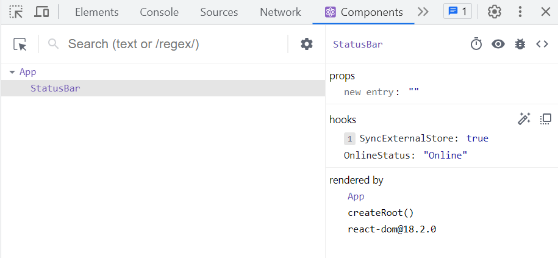

# ?useDebugValue

`useDebugValue` — это хук React, который позволяет добавить метку к пользовательскому хуку в React DevTools.

`useDebugValue(value, format?)`

Параметры:

* `value`: значение, которое вы хотите отобразить в React DevTools. Он может иметь любой тип.
* необязательный `format`: функция форматирования. Когда компонент будет проверен, React DevTools вызовет функцию форматирования с `value` в качестве аргумента, а затем отобразит возвращенное форматированное значение (которое может иметь любой тип). Если вы не укажете функцию форматирования, будет отображаться само исходное `value`.

Вызовите `useDebugValue` на верхнем уровне вашего пользовательского хука , чтобы отобразить удобочитаемое значение отладки:

App.tsx
~~~
import { useOnlineStatus } from './useOnlineStatus';

function StatusBar() {
  const isOnline = useOnlineStatus();
  return <h1>{isOnline ? '✅ Online' : '❌ Disconnected'}</h1>;
}

export default function App() {
  return <StatusBar />;
}
~~~

useOnlineStatus.ts
~~~
import { useSyncExternalStore, useDebugValue } from 'react';

export function useOnlineStatus() {
  const isOnline = useSyncExternalStore(subscribe, () => navigator.onLine, () => true);
  useDebugValue(isOnline ? 'Online' : 'Offline');
  return isOnline;
}

function subscribe(callback: () => void) {
  window.addEventListener('online', callback);
  window.addEventListener('offline', callback);
  return () => {
    window.removeEventListener('online', callback);
    window.removeEventListener('offline', callback);
  };
}
~~~

Это дает компонентам, вызывающим `useOnlineStatus`, метку, например `OnlineStatus: «Online»`, когда вы их проверяете:

Без вызова `useDebugValue` будут отображаться только базовые данные (в данном примере — `true`).

Вы также можете передать функцию форматирования в качестве второго аргумента `useDebugValue`:

~~~
useDebugValue(isOnline ? 'Online' : 'Offline', (value) => `User ${value}`); // OnlineStatus: "User Online"
~~~
