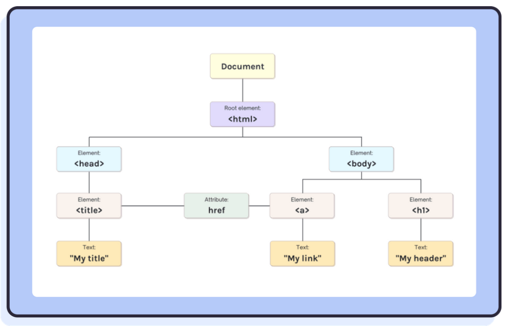

# ?React DOM

### What is the virtual DOM? How does react use the virtual DOM to render the UI?

Частые манипуляции с DOM обходятся дорого и снижают производительность. _Виртуальный DOM_ — это виртуальное представление реального DOM. Когда происходят изменения состояния, виртуальный DOM обновляется и сравнивается предыдущая и текущая версии виртуального DOM.

### Is the virtual DOM the same as the shadow DOM?

_Виртуальный DOM_ — это концепция программирования, реализованная React преимущественно для повышения производительности рендеринга, _Shadow DOM_ — это технология браузера, предназначенная для определения области видимости переменных и CSS в веб-компонентах.

Виртуальный DOM и Shadow DOM звучат похоже по названию, но именно здесь сходство начинается и заканчивается — они совершенно не связаны.

### What is the difference between the virtual DOM and the real DOM?

_DOM (Document Object Model)_ – это объектное представление исходного HTML-кода документа. DOM представляет документ HTML в виде древовидной структуры, в которой каждый узел представляет часть документа (например, элемент, атрибут элемента или текст):

Используя ванильный JavaScript, мы можем получить доступ к любому нужному элементу (например, с помощью `document.getElementById`) и обновить его напрямую. Когда мы делаем это, браузер просматривает DOM и повторно отображает каждый узел, даже если этот узел не изменился с момента предыдущего рендеринга. Это может быть заметно неэффективно.

Здесь в игру вступает виртуальный DOM (VDOM) React.

_Виртуальный DOM_ - копия реального DOM.

React повышает производительность вашего пользовательского интерфейса, создавая «виртуальное» представление DOM. Каждый раз, когда состояние вашего приложения обновляется, React создает новый VDOM и сравнивает его с предыдущим VDOM, чтобы определить, какие изменения необходимы перед прямым и эффективным обновлением DOM.

VDOM — это концепция программирования, предшествовавшая React и принятая многими библиотеками пользовательского интерфейса, включая Vue.
