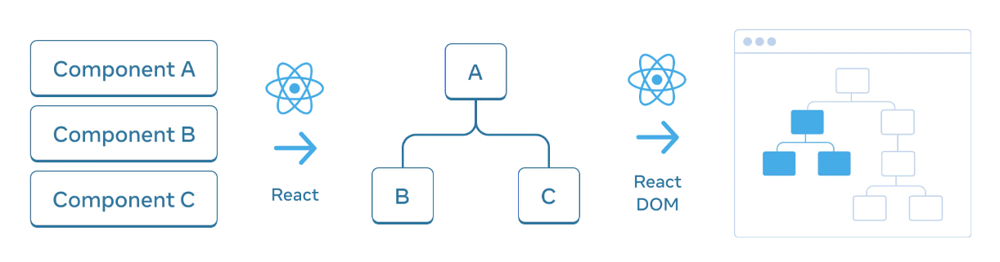

# ?Preserving and resetting state

Состояние изолировано между компонентами. React отслеживает, какое состояние принадлежит какому компоненту, основываясь на их месте в дереве пользовательского интерфейса. Вы можете контролировать, когда сохранять состояние и когда сбрасывать его между повторными рендерингами.

### Дерево пользовательского интерфейса

React также использует древовидные структуры для управления и моделирования пользовательского интерфейса, который вы создаете. React создает деревья пользовательского интерфейса из вашего JSX.

### Состояние привязано к положению в дереве

Когда вы задаете состояние компонента, вы можете подумать, что это состояние «живет» внутри компонента. Но на самом деле состояние хранится внутри React. React связывает каждую часть состояния, которую он хранит, с правильным компонентом в зависимости от того, где этот компонент находится в дереве пользовательского интерфейса.

Здесь есть только один `<Counter />`, но он отображается в двух разных позициях:

~~~
function App() {
  const counter = <Counter />;
  return (
    

      {counter}
      {counter}
    

  );
}

function Counter() {
  const [score, setScore] = useState(0);

  return (
    

      <h1>{score}</h1>
      <button onClick={() => setScore(score + 1)}>Add one</button>
    

  );
}
~~~

Это два отдельных счетчика, поскольку каждый из них отображается в своей позиции в дереве.

Если вы визуализируете два `Counter` рядом, каждый из них получит свое собственное, независимое состояние.

React будет сохранять состояние до тех пор, пока вы визуализируете один и тот же компонент в одной и той же позиции. Чтобы увидеть это, увеличьте оба счетчика, затем удалите второй компонент, сняв флажок, а затем добавьте его обратно, отметив его снова:

~~~
function App() {
  const [showB, setShowB] = useState(true);

  return (
    

      <Counter />
      {showB && <Counter />}
      <label>
        <input
          type="checkbox"
          checked={showB}
          onChange={(e) => {
            setShowB(e.target.checked);
          }}
        />
        Render the second counter
      </label>
    

  );
}

function Counter() {
  const [score, setScore] = useState(0);

  return (
    

      <h1>{score}</h1>
      <button onClick={() => setScore(score + 1)}>Add one</button>
    

  );
}
~~~

Обратите внимание, как в тот момент, когда вы прекращаете рендеринг второго счетчика, его состояние полностью исчезает. Это потому, что когда React удаляет компонент, он уничтожает его состояние.

### Тот же компонент в той же позиции сохраняет состояние

В этом примере есть два разных тега `<Counter />`:

~~~
function App() {
  const [isFancy, setIsFancy] = useState(false);

  return (
    

      {isFancy ? <Counter isFancy={true} /> : <Counter isFancy={false} />}
      <label>
        <input
          type="checkbox"
          checked={isFancy}
          onChange={(e) => {
            setIsFancy(e.target.checked);
          }}
        />
        Use fancy styling
      </label>
    

  );
}

function Counter({ isFancy }: { isFancy: boolean }) {
  const [score, setScore] = useState(0);

  let className = "counter";

  if (isFancy) {
    className += " fancy";
  }

  return (
    

      <h1>{score}</h1>
      <button onClick={() => setScore(score + 1)}>Add one</button>
    

  );
}
~~~

При установке или снятии флажка состояние счетчика не сбрасывается. Независимо от того, является ли `isFancy` `true` или `false`, у вас всегда есть `<Counter />` в качестве первого дочернего элемента `div`, возвращаемого корневым компонентом `App`.

Это тот же компонент в той же позиции, поэтому с точки зрения React это тот же `<Counter />`.

> Помните, что для React важна позиция в дереве пользовательского интерфейса, а не в разметке JSX!

### Различные компоненты в одном и том же состоянии сброса положения

В этом примере установка флажка заменит `<Counter>` на `
`:

~~~
function App() {
  const [isPaused, setIsPaused] = useState(false);
  return (
    

      {isPaused ? 
See you later!
 : <Counter />}
      <label>
        <input
          type="checkbox"
          checked={isPaused}
          onChange={(e) => {
            setIsPaused(e.target.checked);
          }}
        />
        Take a break
      </label>
    

  );
}

function Counter() {
  const [score, setScore] = useState(0);

  return (
    

      <h1>{score}</h1>
      <button onClick={() => setScore(score + 1)}>Add one</button>
    

  );
}
~~~

Здесь вы переключаетесь между различными типами компонентов в одной и той же позиции. Изначально первый дочерний элемент `
` содержал `<Counter />`. Но когда вы заменили `<Counter />` на `p`, React удалил `<Counter />` из дерева пользовательского интерфейса и уничтожил его состояние.

Кроме того, когда вы визуализируете другой компонент в той же позиции, он сбрасывает состояние всего его поддерева:

~~~
function App() {
  const [isFancy, setIsFancy] = useState(false);
  return (
    

      {isFancy ? (
        

          <Counter isFancy={true} />
        

      ) : (
        <section>
          <Counter isFancy={false} />
        </section>
      )}
      <label>
        <input
          type="checkbox"
          checked={isFancy}
          onChange={(e) => {
            setIsFancy(e.target.checked);
          }}
        />
        Use fancy styling
      </label>
    

  );
}

function Counter({ isFancy }: { isFancy: boolean }) {
  const [score, setScore] = useState(0);

  let className = "counter";

  if (isFancy) {
    className += " fancy";
  }

  return (
    

      <h1>{score}</h1>
      <button onClick={() => setScore(score + 1)}>Add one</button>
    

  );
}
~~~

Состояние счетчика сбрасывается при установке флажка.

Как правило, если вы хотите сохранить состояние между повторными рендерингами, структура вашего дерева должна «соответствовать» от одного рендеринга к другому. Если структура отличается, состояние уничтожается, потому что React уничтожает состояние, когда удаляет компонент из дерева.

### Ловушка

Вот почему вы не должны вкладывать определения функций компонентов.

Здесь `MyTextField` определена внутри `MyComponent`:

~~~
function MyComponent() {
  const [counter, setCounter] = useState(0);

  function MyTextField() {
    const [text, setText] = useState("");

    return <input value={text} onChange={(e) => setText(e.target.value)} />;
  }

  return (
    <>
      <MyTextField />
      <button
        onClick={() => {
          setCounter(counter + 1);
        }}
      >
        Clicked {counter} times
      </button>
    </>
  );
}
~~~

Каждый раз, когда вы нажимаете кнопку, состояние ввода исчезает! Это связано с тем, что для каждого рендеринга `MyComponent` создается отдельная функция `MyTextField`. Вы визуализируете другой компонент в той же позиции, поэтому React сбрасывает все состояния ниже. Это приводит к ошибкам и проблемам с производительностью. Чтобы избежать этой проблемы, всегда объявляйте функции компонентов на верхнем уровне и не вкладывайте их определения.

### Сброс состояния в том же положении

По умолчанию React сохраняет состояние компонента, пока он остается в том же положении. Обычно это именно то, что вам нужно, поэтому это имеет смысл в качестве поведения по умолчанию. Но иногда вам может понадобиться сбросить состояние компонента.

Существует два способа сброса состояния при переключении между ними:

1. Отрисовка компонентов в разных положениях.
2. Дайте каждому компоненту явную идентичность с `key`.

Если вы хотите, чтобы эти два `Counters` были независимыми, вы можете отображать их в двух разных позициях:

~~~
function Scoreboard() {
  const [isPlayerA, setIsPlayerA] = useState(true);
  return (
    

      {isPlayerA && <Counter person="Taylor" />}
      {!isPlayerA && <Counter person="Sarah" />}
      <button
        onClick={() => {
          setIsPlayerA(!isPlayerA);
        }}
      >
        Next player!
      </button>
    

  );
}

function Counter({ person }: { person: string }) {
  const [score, setScore] = useState(0);

  return (
    

      <h1>
        {person}'s score: {score}
      </h1>
      <button onClick={() => setScore(score + 1)}>Add one</button>
    

  );
}
~~~

Когда вы нажимаете кнопку `«Next player!»`, первая позиция очищается, но вторая теперь содержит `Counter`.

Существует также другой, более общий способ сброса состояния компонента.

По умолчанию React использует порядок внутри родителя («первый счетчик», «второй счетчик»), чтобы различать компоненты. Но ключи позволяют вам сказать React, что это не просто первый счетчик или второй счетчик, а конкретный счетчик — например, счетчик Тейлора.

В этом примере два `<Counter />` не имеют общего состояния, даже если они появляются в одном и том же месте в JSX:

~~~
function Scoreboard() {
  const [isPlayerA, setIsPlayerA] = useState(true);
  return (
    

      {isPlayerA ? (
        <Counter key="Taylor" person="Taylor" />
      ) : (
        <Counter key="Sarah" person="Sarah" />
      )}
      <button
        onClick={() => {
          setIsPlayerA(!isPlayerA);
        }}
      >
        Next player!
      </button>
    

  );
}

function Counter({ person }: { person: string }) {
  const [score, setScore] = useState(0);

  return (
    

      <h1>
        {person}'s score: {score}
      </h1>
      <button onClick={() => setScore(score + 1)}>Add one</button>
    

  );
}
~~~

Переключение между Тейлором и Сарой не сохраняет состояние. Это потому, что вы дали им разные `key`.

> Помните, что ключи не являются глобально уникальными. Они указывают только позицию внутри родителя.
